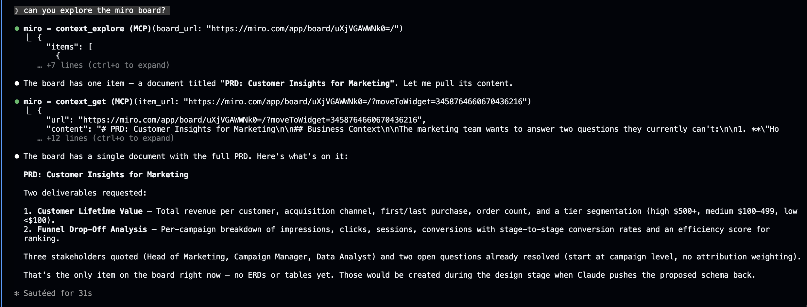
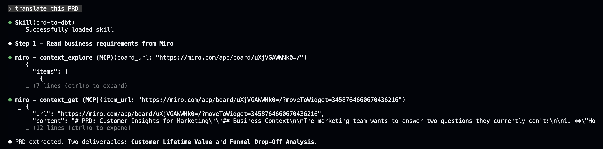
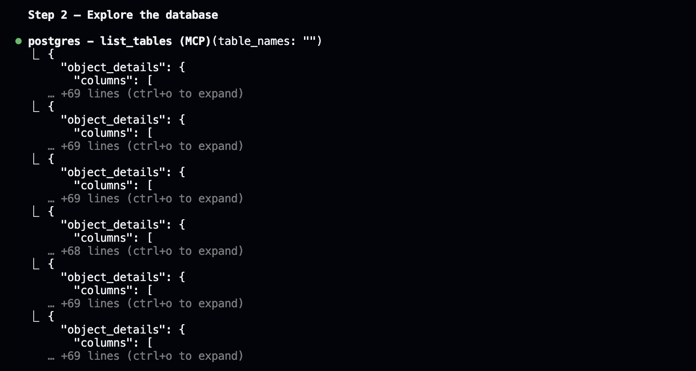
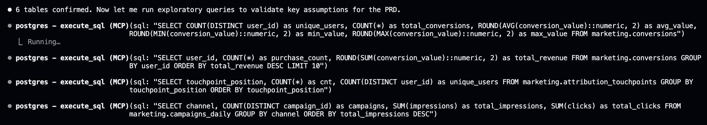
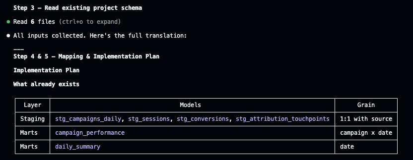
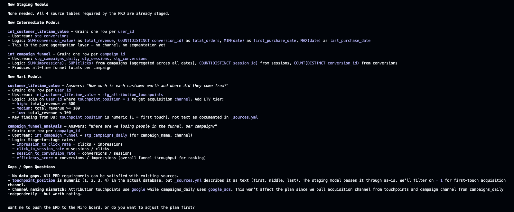
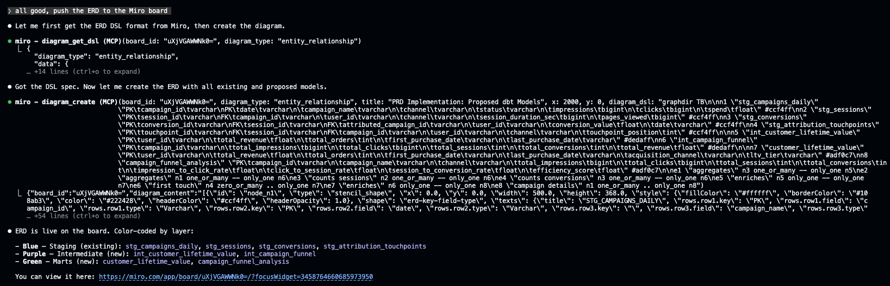

# Stage 2 — Design: Schema on Miro

> After connecting the MCP tools, Claude reads the PRD from the Miro board, explores the database, and proposes an ERD back on the board for review.

## What happens in this stage

1. **Read the PRD** — Claude uses `context_explore` and `context_get` to extract the business requirements from sticky notes and documents on the Miro board.
2. **Explore the database** — Using the Postgres MCP, Claude discovers existing tables (`campaigns`, `sessions`, `conversions`, `users`) and samples data to understand the schema.
3. **Translate to plan** — The `prd-to-dbt` skill maps business concepts (customer lifetime value, funnel drop-off) to concrete dbt models, columns, and joins.
4. **Propose ERD on Miro** — Claude uses `diagram_create` to push an entity-relationship diagram onto the board so stakeholders can review and approve before any code is written.

## Screenshots

### 1. Trigger the skill and read PRD from Miro

The `prd-to-dbt` skill fires `context_explore` + `context_get` to extract the full PRD directly from the Miro board.

### 2. Explore the database

Postgres MCP discovers all 6 tables in the `marketing` schema, then runs exploratory queries to validate assumptions (repeat purchases, touchpoint positions, channel distribution).

### 3. Read existing project + produce implementation plan

Claude reads the dbt project (sources YAML, staging models, marts) and maps every PRD requirement to concrete models, columns, and joins.

### 4. Propose ERD on Miro

Claude uses `diagram_create` to push the proposed schema directly to the board — color-coded by layer (blue = staging, purple = intermediate, green = marts).

## Key files

- [Miro board](https://miro.com/app/board/uXjVGAWWNk0=/?share_link_id=558250594311) — The PRD lives directly on the board (Claude reads it via MCP)
- `.claude/skills/prd-to-dbt/SKILL.md` — The custom skill that drives the translation
