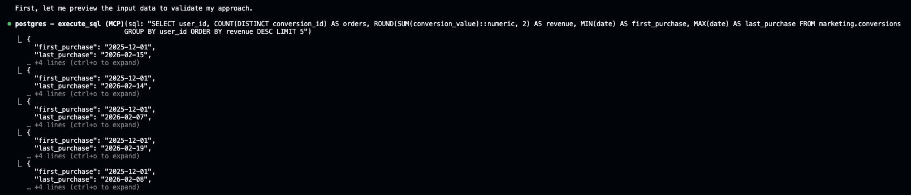
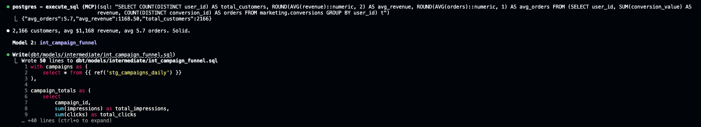
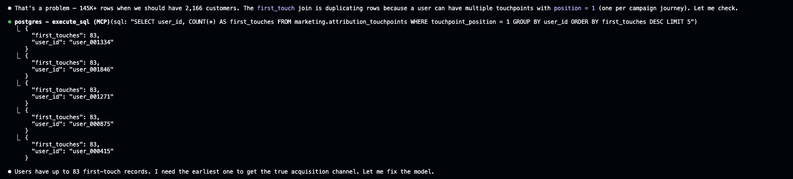
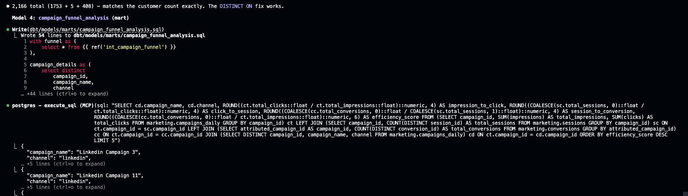
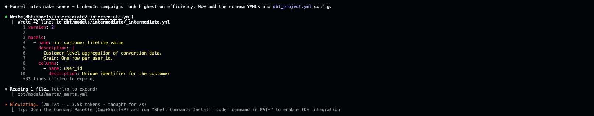
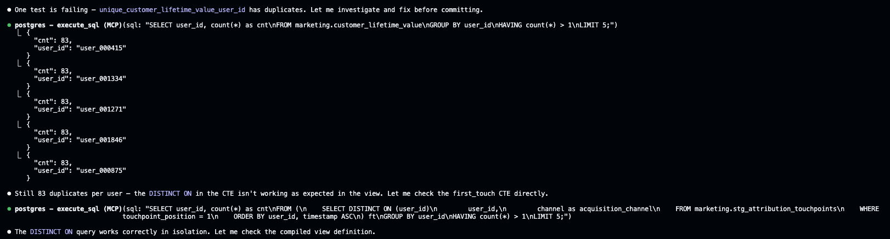

# Stage 3 — Modeling: dbt Implementation

> Once the ERD is approved on Miro, Claude generates the dbt models, schema docs, and tests — then validates everything compiles and passes.

## What happens in this stage

1. **Generate models** — Claude loads the dbt analytics engineering skill, creates a feature branch, and builds models following project conventions.
2. **Validate iteratively** — Each model is validated via Postgres MCP before moving to the next, catching bugs early.
3. **Add schema YAMLs** — Each model gets documented with column descriptions, `not_null`/`unique` tests on primary keys.
4. **Compile & test** — Claude runs `dbt build` via Docker to compile all models and run all tests.
5. **Fix & iterate** — When tests fail, Claude investigates root cause and fixes (e.g., replacing `DISTINCT ON` with `ROW_NUMBER()` when PostgreSQL drops it from view definitions).

## Screenshots

| Step | Screenshot | What's happening |
|------|-----------|-----------------|
| 1 |  | "implement the models" triggers the dbt skill, creates `feature/customer-insights-models` branch |
| 2 |  | Previews conversion data via Postgres MCP to understand input shape before writing SQL |
| 3 |  | Validates 2,166 customers, writes `int_campaign_funnel` intermediate model |
| 4 |  | Catches fan-out bug: first_touch join produces 145K rows (83 duplicates per user) |
| 5 |  | Writes `campaign_funnel_analysis` mart, validates funnel rates (LinkedIn ranks highest) |
| 6 |  | Generates `_intermediate.yml` and updates `_marts.yml` with docs and tests |
| 7 |  | Full Miro board: PRD on the left, generated ERD on the right — the design we're implementing |
| 8 |  | `dbt compile` passes — 10 models found (4 staging + 2 intermediate + 4 marts) |
| 9 |  | `unique_customer_lifetime_value_user_id` test fails — investigates `DISTINCT ON` dropped from view |
| 10 |  | Fixes with `ROW_NUMBER()` window function, which PostgreSQL preserves in view definitions |

## Models created from the PRD

| Model | Layer | Purpose |
|-------|-------|---------|
| `int_customer_lifetime_value` | Intermediate | Revenue, order count, first/last purchase per customer |
| `int_campaign_funnel` | Intermediate | Impressions, clicks, sessions, conversions per campaign |
| `customer_lifetime_value` | Mart | Adds acquisition channel, LTV segmentation (high/medium/low) |
| `campaign_funnel_analysis` | Mart | Stage-to-stage conversion rates, efficiency score |
