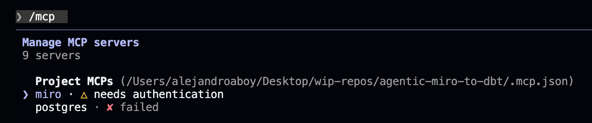
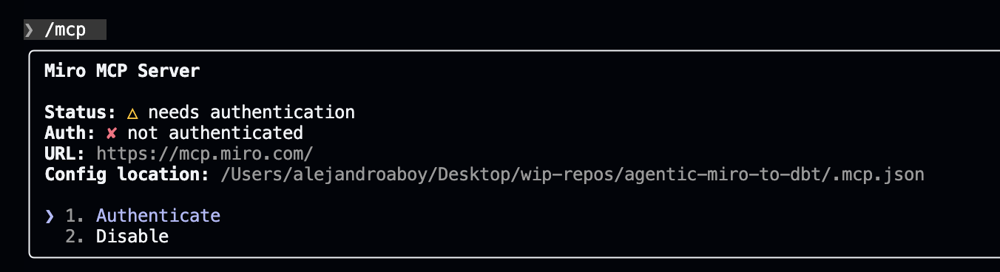
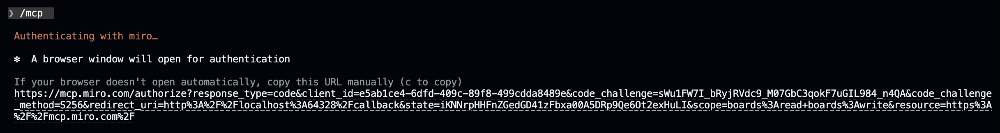
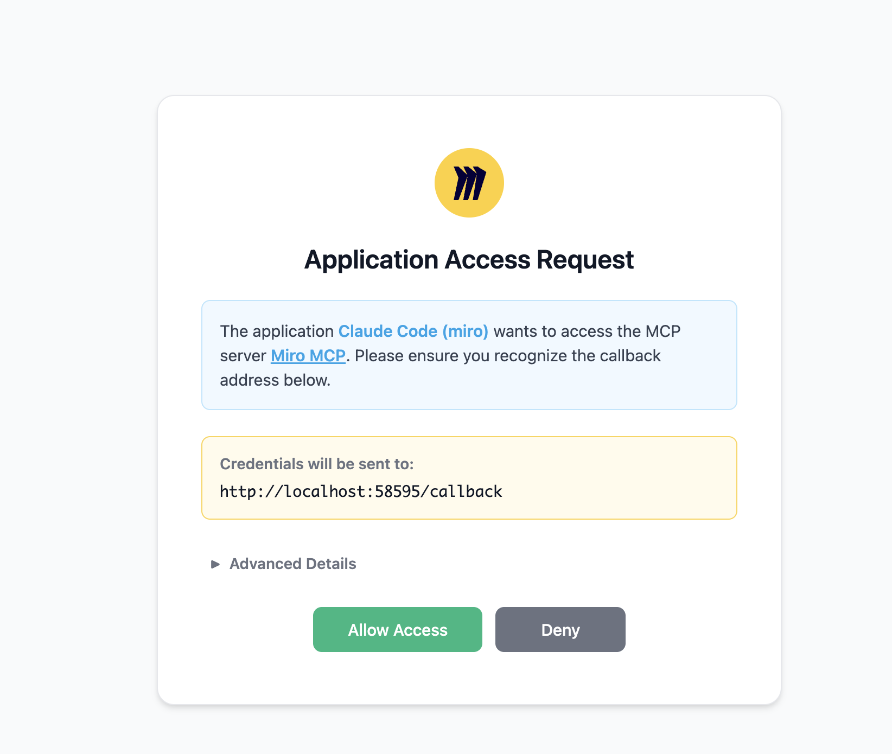
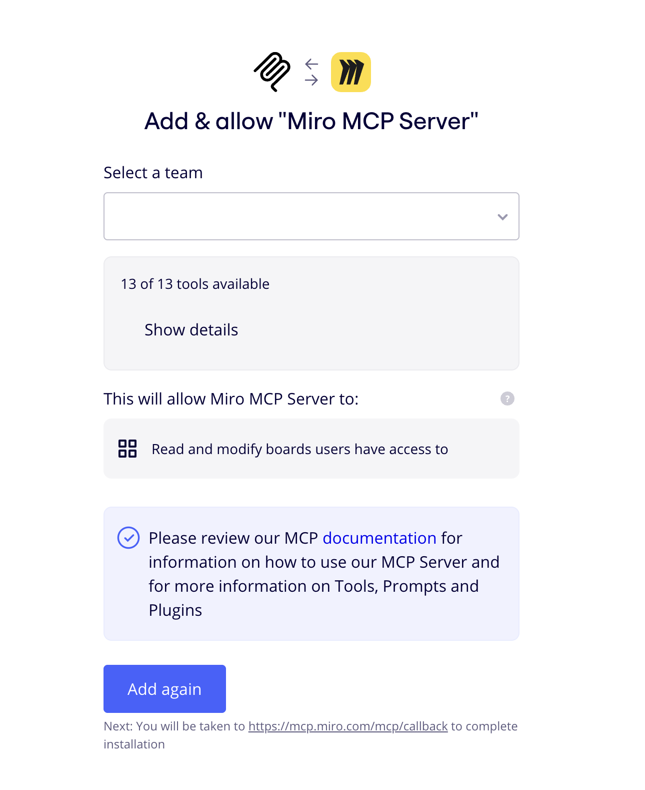
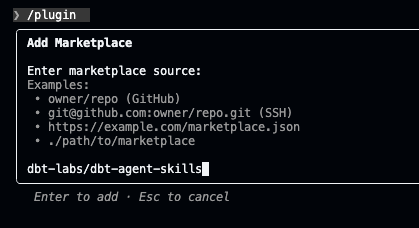
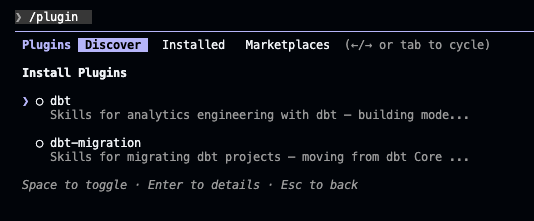
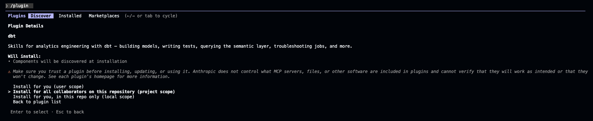

# Stage 1 — Setup

Before running the workflow, connect two tool integrations to Claude Code.

## Miro MCP

The Miro MCP server is pre-configured in `.mcp.json`. Run `/mcp` inside Claude Code, select the Miro server, and authenticate via OAuth.

| Step | Screenshot |
|------|-----------|
| `/mcp` shows Miro needs auth |  |
| Select "Authenticate" |  |
| Browser opens for OAuth |  |
| Allow access |  |
| Select team & confirm |  |

**Result:** `Authentication successful. Connected to miro.`

---

## dbt Agent Skills

Plugin marketplace skills that give Claude Code dbt-specific knowledge for building models, running commands, and writing tests. Used in Stage 3 (Modeling).

| Step | Screenshot |
|------|-----------|
| Add `dbt-labs/dbt-agent-skills` marketplace |  |
| Enter marketplace source |  |
| Discover dbt plugin |  |
| Install at project scope |  |

**Result:** dbt skills available for the modeling stage.
